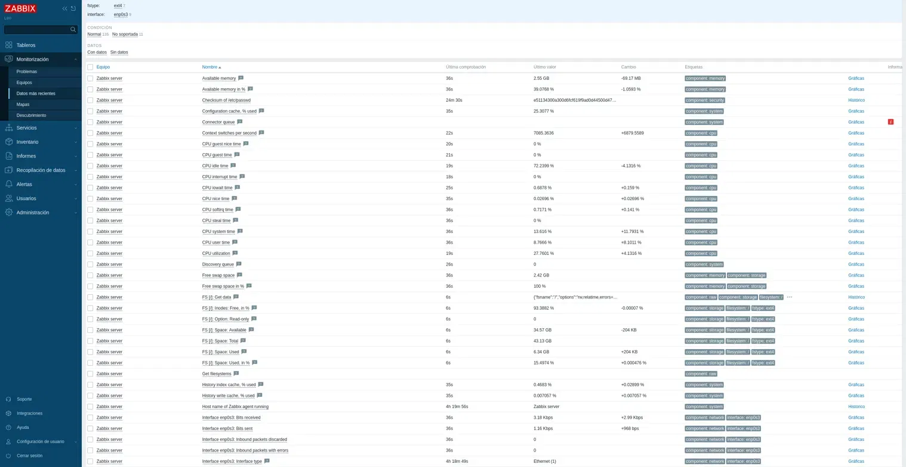
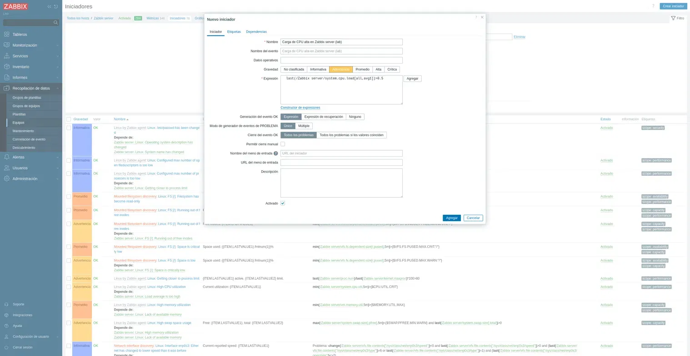
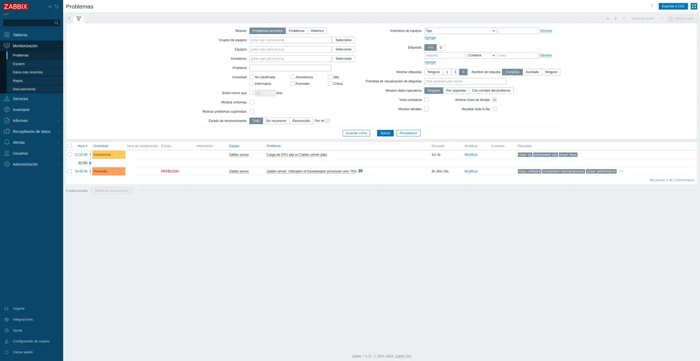
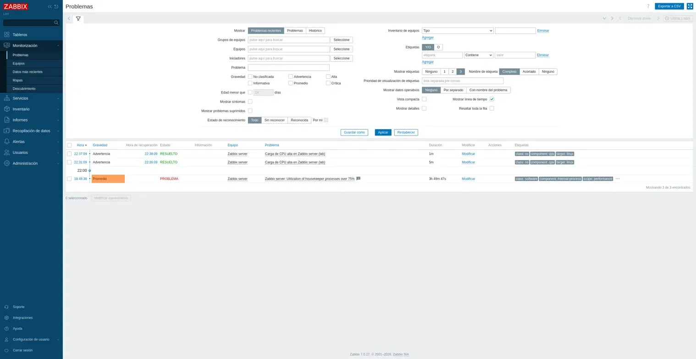

# Zabbix Monitoring Lab

A hands-on home lab where I deployed a Zabbix monitoring server from scratch
on Linux and demonstrated the full monitoring lifecycle — infrastructure
metric collection, alert configuration, incident simulation, and automatic
resolution — the core day-to-day work of a NOC / monitoring analyst.

## Objective

Build a working Zabbix monitoring environment to practice the skills used in
a NOC / monitoring role: deploying the monitoring server, collecting
infrastructure metrics, configuring alert triggers, simulating an incident,
and following its full lifecycle through to resolution.

## Lab Environment

| Component      | Detail                                   |
|----------------|------------------------------------------|
| Hypervisor     | Oracle VirtualBox                        |
| OS             | Debian 13 (Trixie)                       |
| Monitoring     | Zabbix 7.0 LTS (Server, Frontend, Agent) |
| Database       | MariaDB 11.8                             |
| Web stack      | Apache 2.4 + PHP 8.4                      |
| Monitored host | Zabbix server itself (via Zabbix Agent)  |

## What I Implemented

1. Installed Zabbix 7.0 LTS server, web frontend, and agent on Debian 13.
2. Configured MariaDB: created the database and dedicated user, and imported
   the Zabbix schema (170+ tables).
3. Connected the Zabbix server to the database and completed the web setup
   wizard.
4. Verified live infrastructure metrics (CPU, memory, disk, network)
   collected by the Zabbix Agent.
5. Created a custom trigger to alert on high CPU load average.
6. Simulated a real incident with `stress-ng` and watched the alert fire.
7. Observed the alert auto-resolve once load returned to normal — the full
   alert lifecycle.
8. Tuned the trigger threshold after detecting an unrealistic baseline that
   kept the alert permanently active.

## Skills Demonstrated

- Zabbix server deployment and configuration
- Infrastructure monitoring (CPU, memory, disk, network)
- Database setup and schema import (MariaDB)
- Linux service administration (systemctl, log inspection)
- Alert trigger configuration
- Incident simulation and alert lifecycle management
- Threshold tuning to reduce false positives
- Linux (Debian), Apache, PHP

## Walkthrough

### 1. Infrastructure monitoring — live metrics
Latest data from the monitored host, collected by the Zabbix Agent — CPU,
memory, filesystem, and network metrics updating in near real time.

### 2. Alert trigger configuration
A custom trigger that raises a Warning when the 1-minute CPU load average
exceeds the defined threshold.

### 3. Active alert — incident detected
After generating CPU load with `stress-ng`, the trigger fired and the problem
appeared in the Problems view as an active Warning.

### 4. Resolved alert — full lifecycle
Once the load returned to normal, Zabbix automatically resolved the problem,
recording the start time, recovery time, and duration — the complete alert
lifecycle from detection to resolution.

## Lessons Learned

- **Threshold tuning:** my first CPU-load threshold (`0.5`) was too low for
  the VM's normal baseline, so the alert stayed permanently active (a
  "stuck" alert / false positive). I raised it to a realistic value (`3`),
  after which the alert correctly fired only under real load and resolved on
  its own. This mirrors real-world trigger tuning in a monitoring environment.

## Troubleshooting

A real packaging issue solved during the Zabbix installation — exactly the
kind of repository/OS-version mismatch a technician runs into in the field.

### Case — Zabbix packages not found on Debian 13 (wrong repo version)
- **Symptom:** `apt install` found `zabbix-server-mysql` but failed on
  `zabbix-apache-conf` and `zabbix-sql-scripts` with "Unable to locate
  package".
- **Diagnosis:** Reading the `apt update` output showed the official Zabbix
  repository was not being read — only Debian's native (incomplete) packages
  were available. `cat /etc/debian_version` confirmed the OS was Debian 13
  (Trixie), but the repository package that had been installed targeted
  Debian 12 (Bookworm). Forcing the Bookworm repo onto Trixie was the wrong
  approach: it would also have caused a PHP version mismatch (Trixie ships
  PHP 8.4, the Bookworm packages expect 8.2).
- **Resolution:** Removed the mismatched repository configuration
  (`apt remove --purge zabbix-release` and deleted the manual source list),
  then installed the correct Debian 13 repository package
  (`zabbix-release_latest_7.0+debian13_all.deb`). After `apt update`, the
  official Zabbix repo (`repo.zabbix.com/.../debian trixie`) was read
  correctly and all packages installed cleanly.
- **Lesson:** When packages are "not found," check that the repository
  actually matches the OS version. Reading the package manager's output
  pinpointed the mismatch instead of guessing.

## Notes

This lab was built for educational and portfolio purposes in an isolated
virtual environment. No production or sensitive data is involved.

---

**Author:** Leonel Orellana — IT Support · Networking · Cybersecurity · [LinkedIn](https://www.linkedin.com/in/leonel-orellana)
